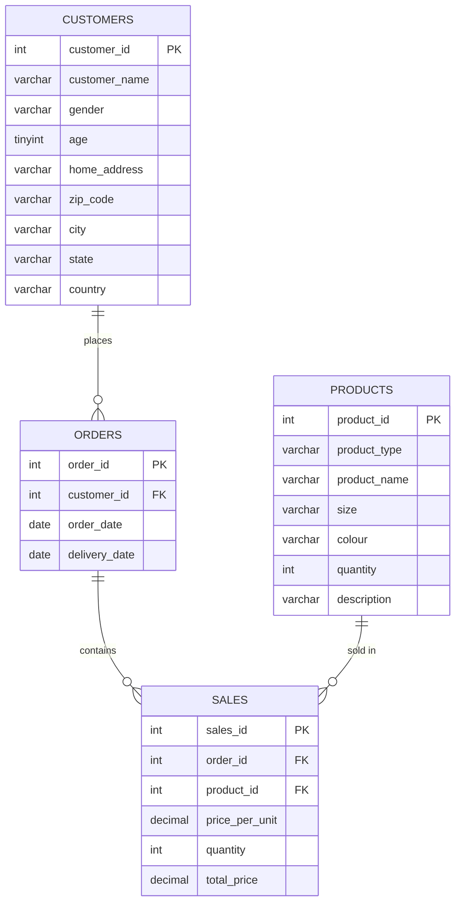

# Shopping Cart EDA Project

A multi-page Streamlit application for exploring and reporting on e-commerce shopping cart data: customers, products, orders, and sales. The app combines exploratory data analysis (EDA), marketing and KPI dashboards, and a voice-driven data assistant powered by the Google Gemini API.

## Features

| Page | Description |
|---|---|
| **Home** | Landing page with a full data preview and an auto-generated data dictionary describing every column. |
| **Univariate Analysis** | Distribution analysis of numerical and categorical fields (age, price, quantity, product type, gender, etc.). |
| **Dashboard KPIs** | Core business metrics — total customers, total orders, total revenue, and average order value. |
| **Marketing Report** | Sales and marketing insights broken down by time period, geography, and product category. |
| **Voice Interface** | Conversational assistant that answers questions about the dataset using natural speech, built on the Gemini API. |

## Tech Stack

- **Framework:** [Streamlit](https://streamlit.io/)
- **Data processing:** pandas, NumPy
- **Visualization:** Plotly Express / Plotly Graph Objects
- **Voice / AI assistant:** Google Gemini (`google-genai`)
- **Storage:** MySQL (source schema), Parquet/CSV (processed data used by the app)

See [requirements.txt](requirements.txt) for pinned package versions.

## Project Structure

```
.
├── Home.py                     # Landing page + data dictionary
├── pages/
│   ├── Univariate Analysis.py  # Distribution charts
│   ├── Dashboard KPIs.py       # KPI summary cards
│   ├── Marketing Report.py     # Marketing/sales breakdowns
│   └── Voice Interface.py      # Gemini-powered voice Q&A
├── store_database.sql          # MySQL schema + seed data (source of truth)
├── cleaned_data.csv            # Flattened, cleaned dataset (CSV)
├── cleaned_data.parquet        # Flattened, cleaned dataset (Parquet, used by the app)
├── EDA steps.ipynb             # Exploratory notebook
├── Shopping Cart EDA.ipynb     # EDA notebook
└── requirements.txt
```

## Getting Started

1. Create and activate an environment with Python 3.12.
2. Install dependencies:
   ```bash
   pip install -r requirements.txt
   ```
3. (Optional, for the Voice Interface page) Add your Gemini API key to a `.env` file:
   ```
   GEMINI_API_KEY=your_key_here
   ```
4. Run the app:
   ```bash
   streamlit run Home.py
   ```

## Database Schema

The source data is modeled as a relational MySQL database (`store_db`) with four tables: `customers`, `products`, `orders`, and `sales`. Orders belong to customers, and each order can contain multiple sale line items, each referencing a product.

### Entity-Relationship Diagram



### Table Reference

**customers**
| Column | Type | Notes |
|---|---|---|
| customer_id | INT | Primary key |
| customer_name | VARCHAR(100) | |
| gender | VARCHAR(30) | |
| age | TINYINT UNSIGNED | |
| home_address | VARCHAR(150) | |
| zip_code | VARCHAR(10) | |
| city | VARCHAR(100) | |
| state | VARCHAR(100) | |
| country | VARCHAR(100) | |

**products**
| Column | Type | Notes |
|---|---|---|
| product_id | INT | Primary key |
| product_type | VARCHAR(50) | e.g. Shirt |
| product_name | VARCHAR(100) | |
| size | VARCHAR(10) | |
| colour | VARCHAR(30) | |
| quantity | INT | Stock quantity |
| description | VARCHAR(255) | |

**orders**
| Column | Type | Notes |
|---|---|---|
| order_id | INT | Primary key |
| customer_id | INT | Foreign key → customers.customer_id |
| order_date | DATE | |
| delivery_date | DATE | |

**sales**
| Column | Type | Notes |
|---|---|---|
| sales_id | INT | Primary key |
| order_id | INT | Foreign key → orders.order_id |
| product_id | INT | Foreign key → products.product_id |
| price_per_unit | DECIMAL(10,2) | |
| quantity | INT | Units sold in this line item |
| total_price | DECIMAL(10,2) | price_per_unit × quantity |

For the app, these four tables are joined and flattened into a single analysis-ready table stored as `cleaned_data.csv` / `cleaned_data.parquet`.

## Data Rebuild (optional)

To recreate the source MySQL database from scratch:

```bash
mysql -u <user> -p < store_database.sql
```

This drops and recreates the `store_db` database and repopulates all four tables from the original data.
